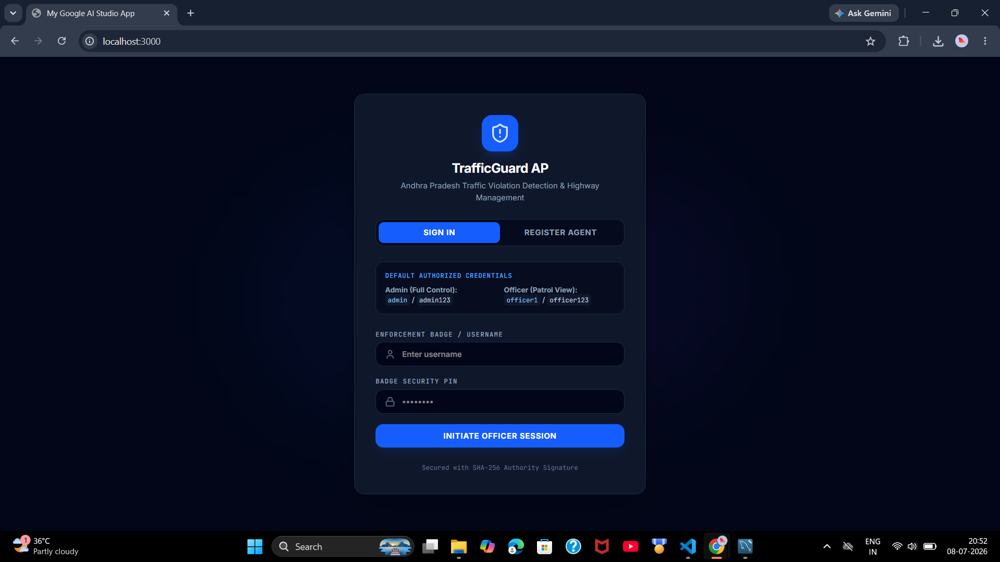
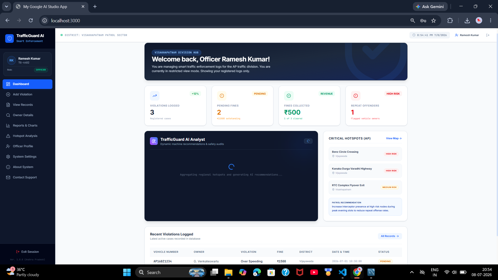
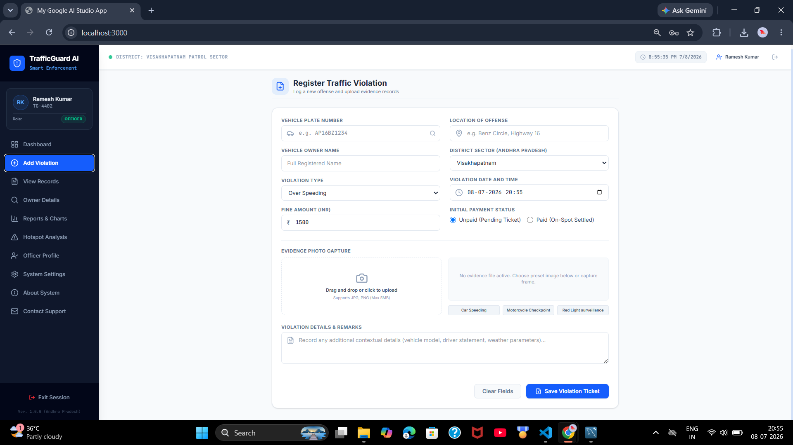
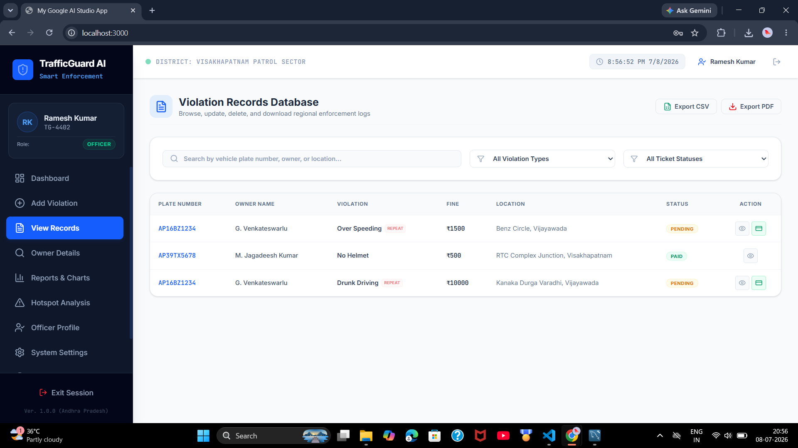
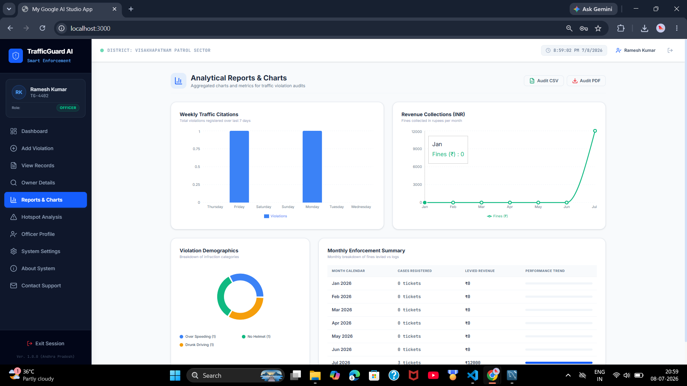
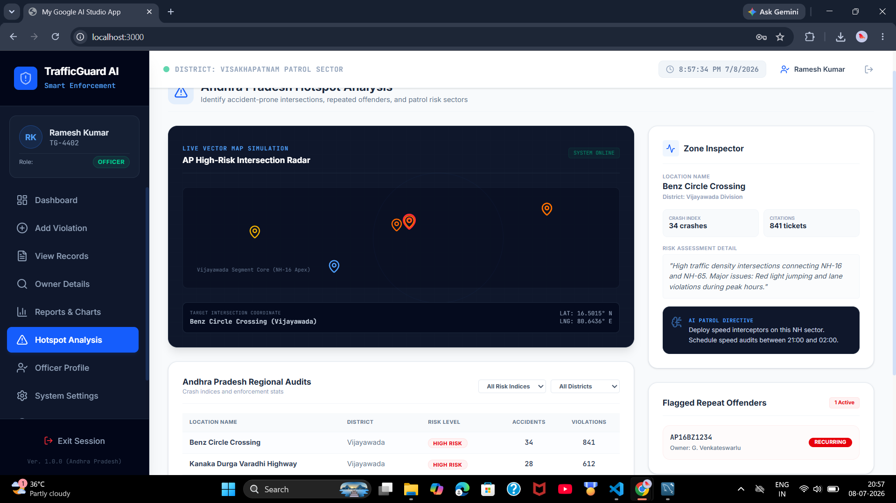
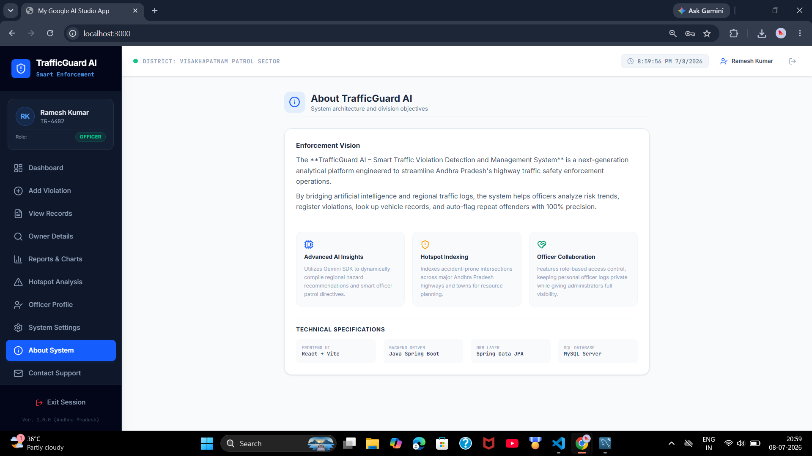

# 🚦 TrafficGuard AI – Smart Traffic Violation Detection and Management System

## 📌 Overview

TrafficGuard AI is a smart traffic violation detection and management system designed to help traffic authorities efficiently record, monitor, and manage traffic violations. The system provides an intuitive dashboard for managing violations, vehicle owner details, reports, and hotspot analysis. It also integrates Google Gemini AI to provide intelligent assistance.

---

## ✨ Features

- 🔐 Secure Officer Login
- 📊 Interactive Dashboard
- 🚗 Add Traffic Violation Records
- 📋 View, Update & Delete Violations
- 👤 Vehicle Owner Management
- 📍 Traffic Hotspot Analysis
- 📈 Weekly & Monthly Reports
- 🤖 Google Gemini AI Integration
- 💾 MySQL Database Support (JSON fallback during development)

---

## 🛠️ Tech Stack

### Frontend
- React
- TypeScript
- HTML5
- CSS3
- Vite

### Backend
- Java
- Spring Boot

### Database
- MySQL

### AI Integration
- Google Gemini API

### Tools
- VS Code
- Git
- GitHub
- MySQL Workbench

---

## 📂 Project Structure

```text
TrafficGuard-AI/
│── backend-java/
│── src/
│── public/
│── package.json
│── server.ts
│── README.md
```

---

## 🚀 Installation

### Clone the Repository

```bash
git clone https://github.com/Reshmitha-Atmakuru/TrafficGuard-AI-.git
```

### Install Dependencies

```bash
npm install
```

### Configure Environment Variables

Create a `.env` file and add:

```env
GEMINI_API_KEY=YOUR_API_KEY
APP_URL=http://localhost:5173

DB_HOST=localhost
DB_USER=root
DB_PASSWORD=YOUR_PASSWORD
DB_NAME=trafficguard
DB_PORT=3306
```

### Run the Project

```bash
npm run dev
```

The application runs at:

```
http://localhost:3000
```

---

## 📸 Screenshots

### Login Page



### Dashboard



### Add Traffic Violation



### View Records



### Reports



### Hotspot Analysis



### About System



---

## 🔮 Future Enhancements

- Automatic Number Plate Recognition
- AI-based Accident Prediction
- CCTV Integration
- SMS & Email Notifications
- Mobile Application Support

---

## 👩‍💻 Author

**Reshmitha Atmakuru**

- GitHub: https://github.com/Reshmitha-Atmakuru

---

## ⭐ Support

If you like this project, please give it a ⭐ on GitHub!